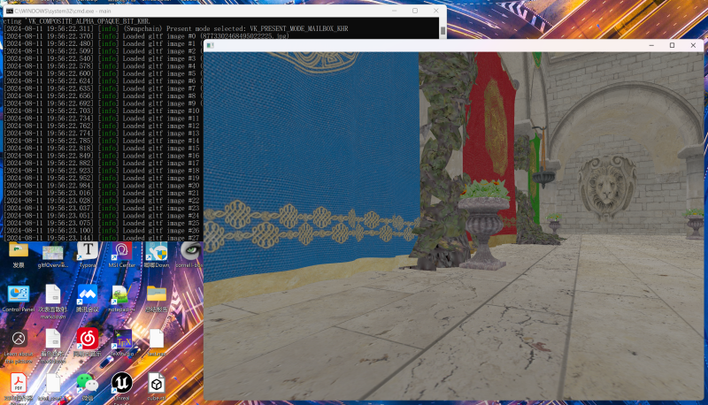

## Screen Shot

## Todo

ImGui 和 Volk 的兼容问题。目前是修改了ImGui的源码，把`#include<vulkan.h>`改为`#include<volk.h>`，这样做不好，日后再改正。

vkb::Instance的构造函数中直接要求添加验证层，这是否需要改？

Renderer 和 Infrastructure 中的 headless 变量是参考官方示例而沿袭的，可能不符合本项目设计，日后再考虑修整。

构建太慢。考虑加快编译。考虑动态库。